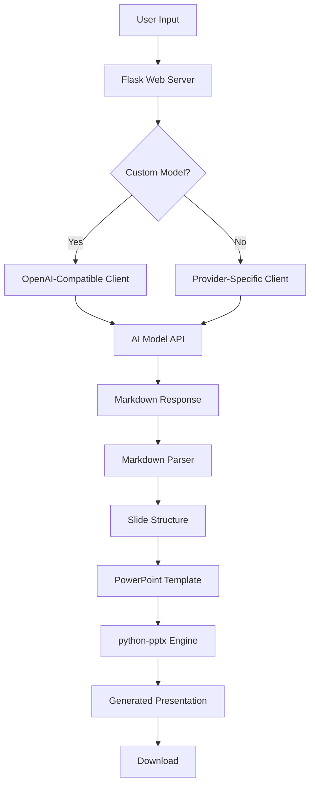

# SlideGen AI - PowerPoint Generator

[](https://www.python.org/)
[](https://palletsprojects.com/p/flask/)
[](LICENSE)

SlideGen AI transforms text content into professionally formatted PowerPoint presentations using AI. It preserves your template's visual identity while leveraging advanced natural language processing to structure content effectively.

## Features

- **Multi-Provider AI Support**: Works with Gemini, OpenAI, Claude, and custom OpenAI-compatible endpoints
- **Template Preservation**: Maintains all visual styling, assets, and layouts from your PowerPoint templates
- **Intelligent Content Structuring**: Automatically organizes content into appropriate slide layouts
- **Rich Text Formatting**: Preserves bold formatting and hierarchical bullet points
- **Responsive Web Interface**: Clean, dark-mode compatible UI with drag-and-drop file upload

## System Architecture



The system follows a modular architecture where the Flask backend orchestrates interactions between AI models and the python-pptx library.

## Technical Implementation

### Content Processing Pipeline

1. **Content Analysis and Structuring**
   The input text is processed by the selected AI model through a specialized system prompt that instructs the LLM to:
   - Parse natural language content into structured slide components
   - Identify logical sections and content hierarchy
   - Map content to appropriate slide layouts
   - Generate properly formatted Markdown with layout annotations

2. **Layout Intelligence**
   The application dynamically analyzes the uploaded PowerPoint template to:
   - Enumerate all available slide layouts and their names
   - Determine layout constraints (title capacity, body content capacity)
   - Identify placeholder types (title, body, content) for each layout
   - Create a layout mapping system that can match semantic layout names to actual template layouts

3. **Markdown-to-Slides Transformation**
   The generated Markdown is parsed by a custom parser that:
   - Extracts layout directives from HTML comments
   - Separates slide titles from content
   - Preserves bullet point hierarchy through indentation tracking
   - Maps slides to appropriate layouts using intelligent fallback mechanisms

4. **Formatting Preservation**
   The system maintains rich text formatting through:
   - Bold text extraction using regex pattern matching
   - Paragraph level management for proper indentation
   - Font size standardization (18pt for body text)
   - Markdown-like syntax processing for emphasis

### Template Style Preservation

The application preserves template integrity through several mechanisms:

**Layout Fidelity**
- Removes all original slides while maintaining master layouts
- Uses existing slide layouts without modification
- Respects placeholder constraints and positioning
- Maintains slide dimensions and orientation

**Visual Consistency**
- Master slide retention for consistent styling
- Color scheme preservation through template inheritance
- Typography settings maintained via layout placeholders
- Background graphics and assets untouched during content replacement

### API Integration

The system supports multiple AI providers through a unified OpenAI-compatible interface:
- **Gemini** (Google AI) - Base URL: `https://generativelanguage.googleapis.com/v1beta/`
- **OpenAI** (GPT models) - Base URL: `https://api.openai.com/v1/`
- **Claude** (Anthropic) - Base URL: `https://api.anthropic.com/v1/`
- **Custom Endpoints** - User-provided OpenAI-compatible APIs

Each provider is configured with appropriate base URLs and model mappings, with dynamic client initialization based on user selection.

## Setup Instructions

### Prerequisites
- Python 3.8 or higher
- pip package manager
- Virtual environment (recommended)

### Local Installation

1. **Clone the Repository**
   ```bash
   git clone https://github.com/jaideepm0/ppt-gen.git
   cd TDS-EXTRA_PPT
   ```

2. **Create Virtual Environment (Recommended)**
   ```bash
   python -m venv venv
   source venv/bin/activate  # On Windows: venv\Scripts\activate
   ```

3. **Install Dependencies**
   ```bash
   pip install -r requirements.txt
   ```

4. **Run the Application**
   ```bash
   python app.py
   ```

5. **Access the Web Interface**
   Open your browser and navigate to `http://localhost:7860`
